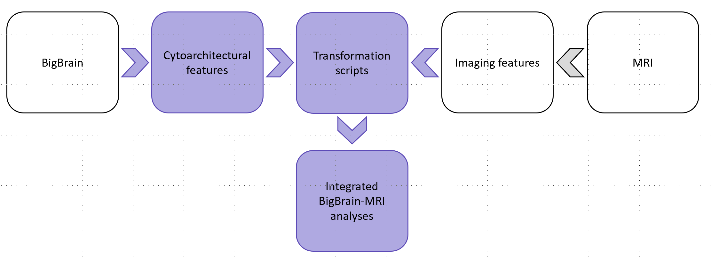

.. **BIG BRAIN WARP**
   ============================
.. title:: BIG BRAIN WARP

.. raw:: html

   

**Welcome to BIG BRAIN WARP**
==========================================

Integrating BigBrain with multi-modal imaging 
----------------------------------------------------
BigBrain is a singular dataset that offers an ultra-high-resolution (20µm) volumetric reconstruction of a sliced and stained post-mortem human brain (Amunts et al. 2013). **BigBrainWarp** aims to enable integration of BigBrain with neuroimaging and other neurobiological modalities, helping a wide range of neuroscientists to utilise the cytoarchitectural information encoded in BigBrain for multi-scale neuroscientific discovery.

In the toolbox, you’ll find preprocessed BigBrain data, scripts to transform between BigBrain and standard MRI spaces, and a selection of histology-derived feature maps already transformed to MRI space.

Additionally, we’ve created a series of tutorials that illustrate potential workflows for BigBrain-MRI integration.

Tips for Getting Started
****************************

* Read the BigBrainWarp preprint `<https://doi.org/10.1101/2021.05.04.442563>`_
* Watch a recent talk on the motivations and functionality of BigBrainWarp `https://youtu.be/Stg_R63GyVY <https://youtu.be/Stg_R63GyVY>`_
* Check out the tutorials. They are intended to show interesting ways to use BigBrain with multi-modal imaging and contain extra details on what's under the hood of the *BigBrainWarp*.
* Get in touch if you have any questions 🤙

.. raw:: html

    

.. toctree::
   :maxdepth: 1
   :hidden:
   :caption: Getting started
   
   pages/installation
   pages/bigbrain_background

.. toctree::
   :maxdepth: 1
   :hidden:
   :caption: What's inside

   pages/scripts
   pages/toolbox_contents
   pages/updates

.. toctree::
   :maxdepth: 1
   :hidden:
   :caption: Tutorials
   
   pages/tutorials_overview
   pages/tutorial_gradients
   pages/tutorial_communities
   pages/tutorial_confluence

.. toctree::
   :maxdepth: 1
   :hidden:
   :caption: What's outside

   pages/cross_pollination

.. toctree::
   :maxdepth: 1
   :hidden:
   :caption: Footnotes

   pages/FAQs
   pages/glossary   
   pages/citing
   pages/references
   pages/acknowledgements

__________________________________________________________________________________________________

.. raw:: html

    

Core developers 
------------------

- Casey Paquola, INM-1, Forschungszentrum Jülich & MICA Lab, Montreal Neurological Institute
- Boris Bernhardt, MICA Lab, Montreal Neurological Institute

Please drop us a line if you're interested in contributing!
