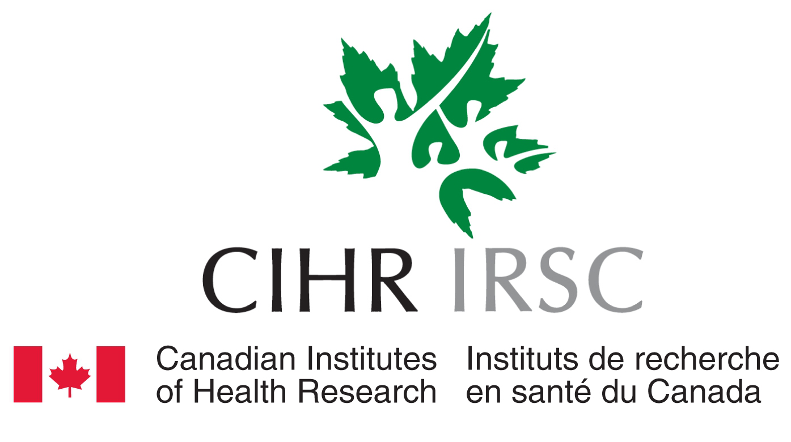
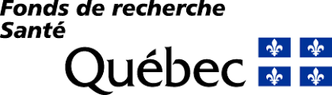

Acknowledgements
==================

We'd like to recognise the support of the Canadian Institutes of Health Research (CIHR), Fonds de la recherche en santé du Québec (FRQS) and Helmholtz International BigBrain Analytics & Learning Labratory (HIBALL).

.. figure:: ./images/logo-hiball.png
   :height: 50px
   :align: center

The work is conducted through a collaboration of researchers at the Neuro and Jülich Forschungszentrum.

.. figure:: ./images/logo-neuro.png
   :height: 50px
   :align: center

.. figure:: ./images/logo-julich.png
   :height: 50px
   :align: center
