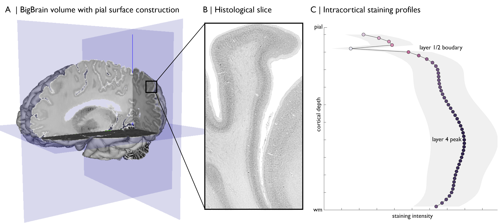
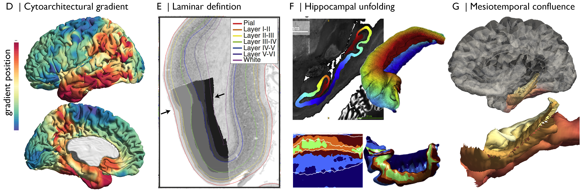

BigBrain Background
====================================

What is BigBrain?
****************************

“An ultrahigh-resolution three-dimensional (3D) model of a human brain at nearly cellular resolution of 20 micrometers, based on the reconstruction of 7404 histological sections.” (`Amunts et al., 2013 https://doi.org/10.1126/science.1235381`_). BigBrain volumes can be downloaded from https://bigbrain.loris.ca/main.php. While the original slicing and staining were performed at 20µm, these have been upsampled for volumetric releases to 40µm, 100µm, 200µm, 300µm, 400µm and 1000µm. The 40µm versions are released as blocks, whereas lower resolutions are provided as a single, whole brain volume.
The grey and white matter boundaries of the cortical surface were originally released with BigBrain, containing 163842 vertices per hemisphere that are aligned between grey and white matter surfaces. Since then, a number of additional surface reconstructions have been published from which we may attain a range of metrics (Table 1). While we could characterise cortical morphometry from this data, the real advantage of BigBrain is in the use of the staining intensity. Unlike, structural MRI, BigBrain intensities directly relate to cells. The Merker staining is a form of silver impregnation for cell bodies that produces a high contrast of black pigment in cells on a virtually colorless background (Merker, 1983). Stained histological sections were then digitized at 20µm, resulting in greyscale images with darker colouring where many or large cells occur. The density and size of cells varies across laminar, as well as areas, thus capturing the regional differentiation of cytoarchitecture. It’s common practice to invert the values of the intensity, so higher values correspond to higher cell density. Given the high resolution, we can sample from many cortical depths to attain a profile of the cytoarchitecture. This is achieved by constructing a set of surfaces within the cortex. The best approach at the moment involves equivolumetric surface construction, whereby the surfaces are initialised at equidistant depths, then modulated by the curvature of the cortex (Waehnert et al., 2014). This holds advantages for histological data because laminar vary in thickness depending on curvature of the cortex (Bok, 1929).

What is BigBrain?
****************************

.. list-table::
   :widths: 50 50 50
   :header-rows: 1

   * - Surfaces
     - Use for ...
     - Reference
   * - Grey and white (isocortex)
     - Initialisation and visualisation
     - Amunts et al., 2013
   * - Layer 1/2 boundary & Layer 4
     - Boundary conditions
     - Wagstyl et al., 2018
   * - Equivolumetric
     - Staining intensity profiles
     - Waehnert et al., 2014
   * - Six layers
     - Laminar thickness
     - Wagstyl et al., 2020
   * - Hippocampus
     - Initialisation and visualisation
     - DeKraker et al., 2019
   * - Mesiotemporal confluence
     - Initialisation and visualisation
     - Paquola et al., 2020

