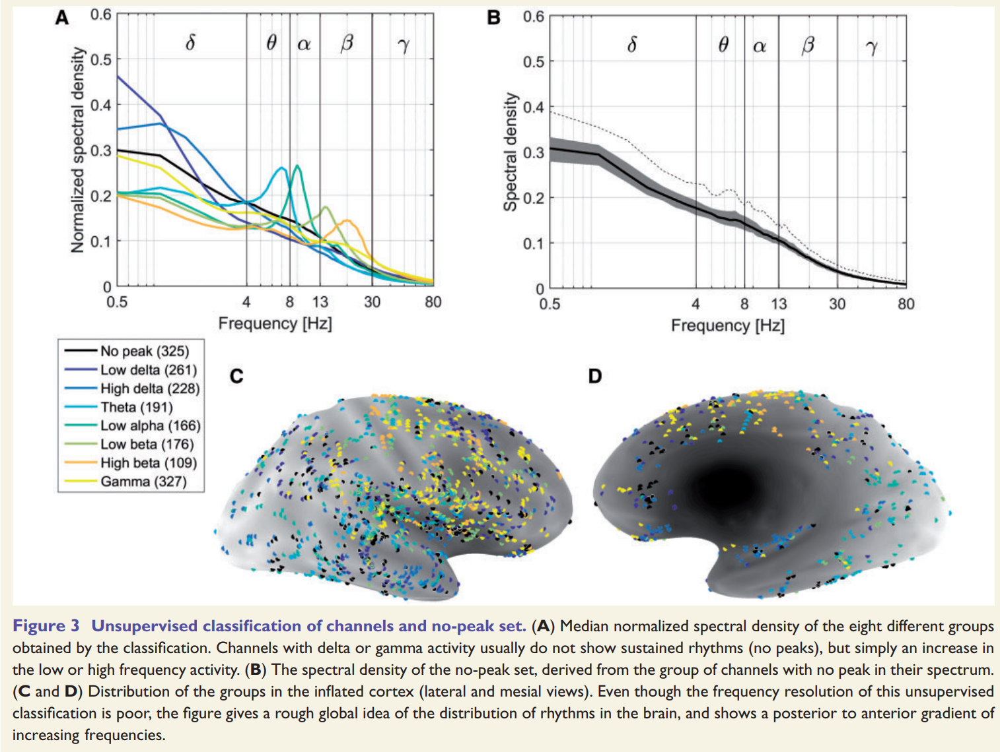
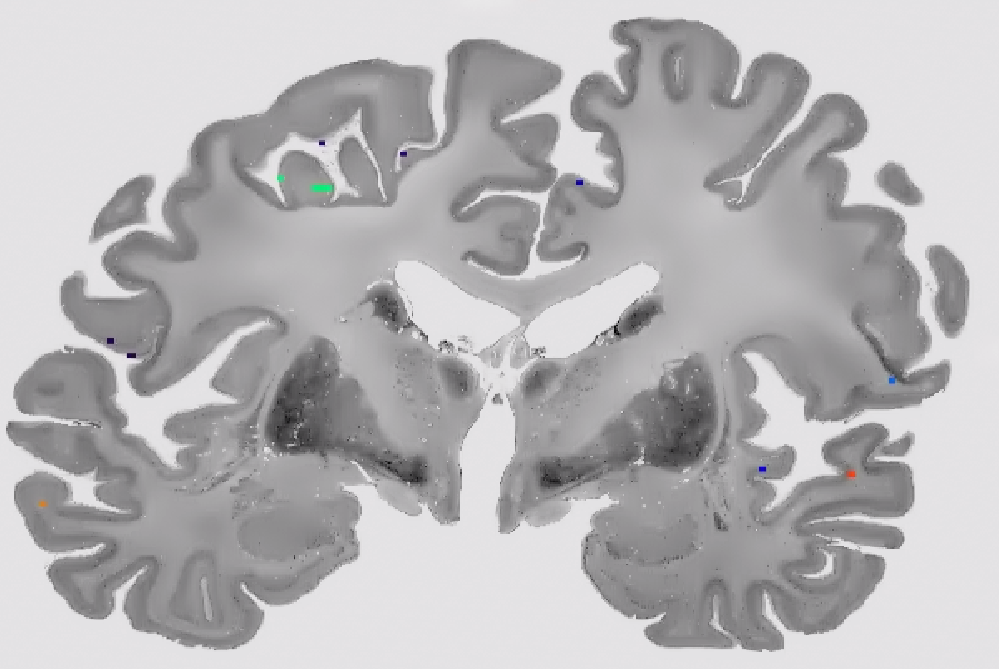

Mapping an atlas of intracranial EEG to BigBrain space
======================================================

Normal physiological activity of neuronal populations have been recorded with stereo-EEG electrodes and cortical grids/strips, and collated across 106 subjects to construct an atlas of intracranial EEG with 1772 channels (`Frauscher et al., 2018 <https://academic.oup.com/brain/article/141/4/1130/4915909>`_). Channel signals and their positions (co-registered to MNI152) are provided as an `open web resource <https://mni-open-ieegatlas.research.mcgill.ca>`_. Here, we aim to adjust the coordinates of the channels to BigBrain space to facilitate complementary histological analyses.

   
   Positioning and classification of channels from Frauscher et al., (2018)

Step 1: Coordinates -> Volume
*******************************
Bipolar channel locations are provided as a list of coordinates in MNI152 (specifcally, ICBM2009 nonlinear symmetric space). First, we project the channel locations into a MNI152 mask.

.. code-block:: matlab

    % create empty volume using the icbm mask
    hdr = niftiinfo([bbwDir '/maps/mni152_space/mni_icbm152_t1_tal_nlin_sym_09c_mask.nii']);
    vol = zeros(hdr.ImageSize);

    % load channel coordinates
    tbl = readtable([homeDir '/data/ChannelInformation.csv']);  % downloaded from https://mni-open-ieegatlas.research.mcgill.ca 
    
    % place channels in the volume
    subs = round(table2array(tbl(:,6:8)) - hdr.Transform.T(4,1:3)); % get 3D subscript of each channel
    ind = sub2ind(hdr.ImageSize, subs(:,1), subs(:,2), subs(:,3));
    vol(ind) = 1:length(ind);
    
    % save out volume
    hdr2 = hdr;
    hdr2.Filename = [bbwDir '/maps/mni152_space/iEEG_channels_icbm.nii'];
    hdr2.Description = 'ChannelInformation.csv on mni_icbm152_t1_tal_nlin_sym_09c_mas';
    niftiwrite(single(vol), [bbwDir '/maps/mni152_space/iEEG_channels_icbm.nii'], hdr2)

Step 2: MNI152 -> BigBrain 
*******************************

Next, we use a three-step transformation procedure (2 nonlinear, 1 linear) to realign the MNI152 volume to BigBrain space. The three-step procedure is contained in icbm_to_bigbrain.sh, which requires three arguments: the file name to be transformed, the path to the BigBrainWarp directory and the type of interpolation.

.. code-block:: bash

    bbwDir=/path/to/BigBrainWarp
    nii2mnc ${bbwDir}/maps/mni152_space/iEEG_channels_icbm.nii ${bbwDir}/maps/mni152_space/iEEG_channels_icbm.mnc
    sh icbm_to_bigbrain.sh ${bbwDir}/maps/mni152_space/iEEG_channels_icbm $bbwWarp nearest_neighbour
    

Step 3: Label electrodes with BigBrain grey/white matter masks and cortical parcels
**************************************************************
We'll use the classified BigBrain volumes to identify whether each channel is in grey or white matter; `full_cls_1000um.mnc <https://bigbrain.loris.ca/main.php?test_name=brainclassifiedvolumes&release=2015>`_. We'll also label each channel according to the `Harvard-Oxford cortical and subcortical atlases <https://fsl.fmrib.ox.ac.uk/fsl/fslwiki/Atlases>`_. The authors of the iEEG atlas provide region names for each channel, so this can help us check the efficacy of the alignment. We take the `world-coordinate <http://www.bic.mni.mcgill.ca/software/minc/minc2_uguide/node22.html>`_ of each channel from the iEEG volume and sample the intensity in the classified volume and Harvard-Oxford atlas (transformed to BigBrain space), then write these values to a series of text files. 

.. code-block:: bash

   # for example, how to sample the intensities from the classified volume
   sh sample_iEEG_channel_intensities.sh full_cls_1000um cls /path/to/BigBrainWarp
   

.. figure:: ./images/iEEG_channel_table.PNG
   :height: 200px
   :align: center
   
   The cross-reference table shows an overlap in the regional labels of the channels pre and post transformation.
   Some channels, however, fall outside of BigBrain, showing the possiblity of further improvment of the algorithm.

Step 4: Map cortical electrodes to nearest surface vertex
**************************************************************

