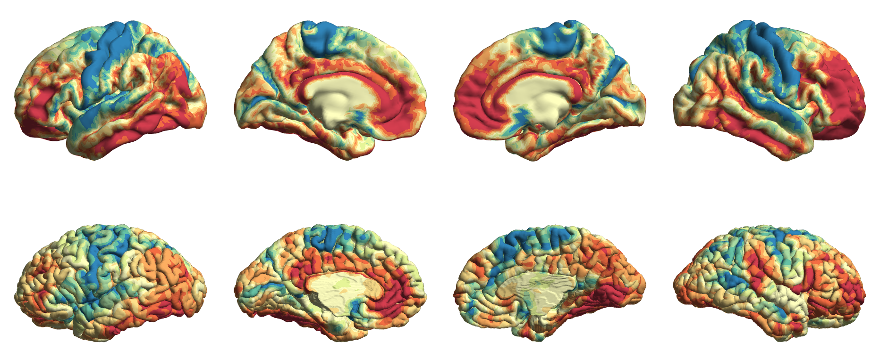

Bridging between BigBrain and MRI
======================================================

Integrating histological information with in vivo neuroimaging can deepen our understanding of neuroanatomy and structure-function coupling in the human brain. 
Recently, Xiao et al., (2019) optimised a nonlinear transformation procedure to shift data between BigBrainSym and standard MNI152 space. 
Here, we provide simple scripts to transform your own data, as well as MRI-derived maps on the BigBrain surface, such as gradients.

Transformations in volume space
********************************

Only one line of code is necessary to transform from icbm to bigbrain volumetric space, or vice versa. You will just need to supply the path to the file you want to transform (can be.mnc or .nii), the bigbrain space (histological or sym), the interpolation method (linear or nearest neighbour), your working directory and whether you would like the function to clean up intermediary files. 

.. code-block:: bash

	# For example, if you've definied a region of interest in BigBrain histological space, this can be transformed to icbm like so:
	sh bigbrain_to_icbm.sh ROI.mnc histological nearest_neighbour my_working_directory y
	# This will output my_working_directory/ROI_icbm.mnc, which can be examined by overlaying on BigBrainWarp/spaces/icbm/mni_icbm152_t1_tal_nlin_sym_09c.mnc

	# Conversely, if you have, say, an activation map in icbm, you can use the opposite script to transform it to BigBrain space:
	sh icbm_to_bigbrain.sh activation.nii sym linear my_working_directory n
	# The output will be my_working_directory/activation_bigbrain.nii
	# Note, the final file type (.mnc or .nii) is determined by the input

Transformations for surface-based data
***************************************

We've devised a basic procedure to transform data from fsaverage and the BigBrain surface. This involves:

i) fsaverage surface to MNI152 volume using the Wu et al., (2018) technique
ii) Nonlinear transformation from MNI152 to BigBrainSym volume using an inverted version of the Xiao et al., (2019) technique
iii) Coordinate-based sampling along BigBrain surface

This may be accomplished using the following script and works on common freesurfer formats (.annot, .thickness, .curv), .gii and .txt files. The function is executed in bash, but beware it does call matlab. 

.. code-block:: bash

	# Take your input data, say a group-dstored for left and right hemisphere separately. 
	sh fsaverage_to_bigbrain.sh lh_data rh_data interp_method output_name

MRI-derived gradients on the BigBrain surface
********************************************

Using the above procedure, we transformed MRI-derived functional and microstructural gradients onto the BigBrain surface. For further information on cortical gradients, we recommend the readers to Margulies et al., (2016), Paquola et al., (2019) and the `BrainSpace toolbox <https://brainspace.readthedocs.io/en/latest/>`_. Briefly, these gradients represent the principle axes of variation in resting state functional connectivity and similarity in intracortical architectecture. We generated functional connectivity and microstructural similarity at a vertex-level on the fsaverage5 template for 47 healthy individuals, averaged the matrices across the cohort, extracted the principles axes of variation using diffusion map embedding, then transformed the first gradients to the BigBrain surface.

   
   Gradient of microstructural similarity on fsaverage5 (above) and BigBrain (below)
   

