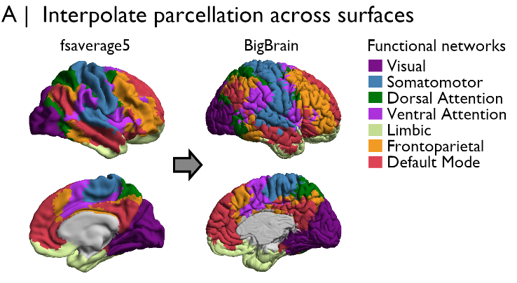
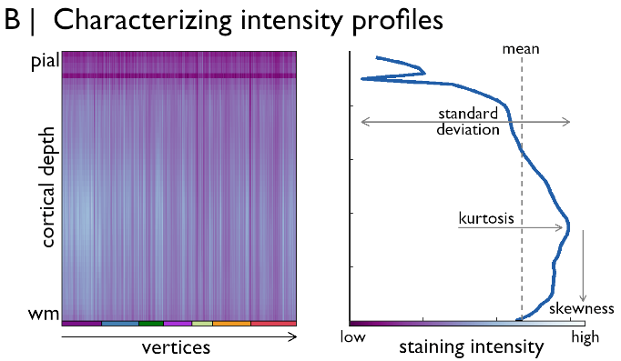
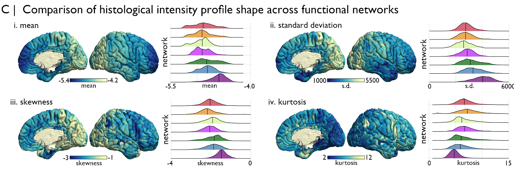

Tutorial 2: Cytoarchitectural characterisation of functional communities
============================================================================================================

Intrinsic functional communities are commonly defined by endogenous co-fluctuations in the BOLD response, which illustrate a temporal concordance of the timeseries in distributed areas of the cortex that are highly consistent across individuals. In this tutorial, we aim to characterise the cytoarchitecture of these intrinsic functional communities using BigBrain.

First things first, we should give some forethought to the data and potential transformations necessary for this analysis. Cytoarchitecture can be examined using BigBrain microstructure profiles, which are aligned to BigBrain surfaces. We can define population-average functional communities using the `Yeo, Krienen <https://doi.org/10.1152/jn.00338.2011>`_ atlas, which is openly available on a variety of standard surfaces and volumes. Given we’re using cytoarchitectural information on the BigBrain surface, we’ll also select a surface version of the Yeo, Krienen atlas. This also conforms with the original creation of the atlas. Specifically, we will use the fsaverage5 version with 7 functional communities and plan to transform the atlas to the BigBrain surface.

The transformation from fsaverage5 to the BigBrain surface can be conducted in BigBrainWarp using one line of code. Under the hood, the code involves a nearest neighbour interpolation from fsavearge5 vertices to BigBrainSym vertices. We have precomputed the indexing for this procedure, so it is quick and easy to run with new iterations. We've alsready transformed the 7 and 17 Network Yeo, Krienen atlases to BigBrain for you and they can be found in the BigBrainWarp/bigbrainsym/. Following this interpolation, we should double check visually that the registration is anatomically sound. 

.. code-block:: bash

	fsaverage_to_bigbrain lh.Yeo2011_7Networks_N1000.annot rh.Yeo2011_7Networks_N1000.annot BigBrainWarp/bigbrainsym/Yeo2011_7Networks

Check ✔️. Then, we can load the microstructure profiles from the BigBrainWarp repository and calculate the central `moments <https://bigbrainwarp.readthedocs.io/en/latest/pages/glossary.html>`_ of each profile. The central moments are an efficient parameterisation of a distribution that have been used with histological data previously to perform observer-independent identification of areal borders (`Schleicher, 1999 <https://doi.org/10.1006/nimg.1998.0385>`_).

.. code-block:: matlab

	% load BigBrain profiles
	load([bbwDir '/data/BB_profiles.mat'], 'MPsurface')
	
	% calculate moments
	BB_moments(1,:) = mean(MPsurface);
	BB_moments(2,:) = std(MPsurface);
	BB_moments(3,:) = skewness(MPsurface);
	BB_moments(4,:) = kurtosis(MPsurface);

Projecting the first four moments onto BigBrain, we can see how cytoarchitectural variations across the cortical surface. Then using the transformed atlas to assign each vertex to a functional community, we can observe different distributions of central moments. For example, the visual network, in particular, exhibits a distinct cytoarchitecture. 

