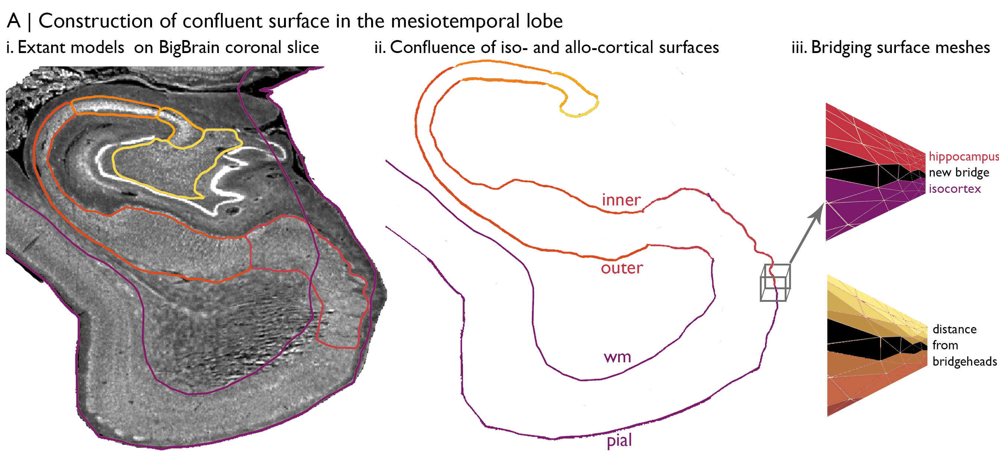
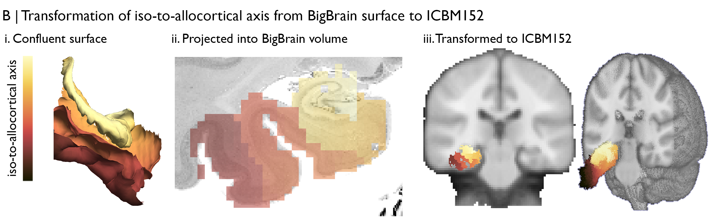
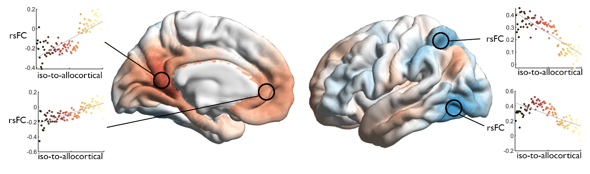

Tutorial 3: Variations in resting state functional connectivity along a histological axis
============================================================================================================

In this tutorial, we aim to transform an axis defined on the BigBrain surface to a standard MRI volume, then explore variations in resting state functional connectivity (rsFC) along the histological axis.

First, we should identify the input data and the necessary transformations. In this particular case, we’ll be using microstructure profiles constructed across the medial temporal lobe, ie: the :ref:`cortical confluence <glossary>`_, which are linked to surfaces in BigBrain space. The rs-fMRI data comes from 50 healthy adults, acquired as part of MICs, and are already preprocessed using `micapipe <https://micapipe.readthedocs.io/en/latest/>`_. Specifically, we’ll use deconfounded BOLD timeseries that have already been nonlinearly transformed to ICBM152 space. This means we’ll need to propagate the BigBrain-defined axis from surface to volume space, then perform a transformation from BigBrain volume to the ICBM152 volume. Fortunately, a nonlinear BigBrain-to-ICBM152 transformation has already been optimised and openly shared by `Xiao et al., (2019) <https://www.nature.com/articles/s41597-019-0217-0>`_ 🥳, so all we will have to work out is how to project the axis into the BigBrain volume and how to use the Xiao et al., transformation matrix. 

Let’s begin with the construction of the histological axis. Here, we’re interested in capturing the principle axis of cytoarchitectural differentiation in the medial temporal lobe. For this project, we bridged hippocampal and `isocortical <https://bigbrainwarp.readthedocs.io/en/latest/pages/glossary.html>`_ surface meshes of BigBrain, which were both in native BigBrain space. This provides an ultra-high-resolution depiction of the curvature of the mesiotemporal lobe. Then, we can map the geodesic distance from each vertex to the intersection, creating an iso-to-allocortical axis in the mesiotemporal lobe. Additionally, we generate 14 intracortical `equivoumetric <https://bigbrainwarp.readthedocs.io/en/latest/pages/glossary.html>`_ surfaces between the pial/inner and white matter/outer surfaces to capture the full expanse of mesiotemporal lobe and to facilitate characterisation of the cytoarchitecture. For now, we will focus on the distance-based iso-to-allocortical axis. 

	Building a continuous cortical surface model of the MTL.

Vertices are matched across surfaces. In other words, vertex 100 has the same iso-to-allocortical axis value at each of the 14 surfaces. Each surface is comprised of a set of 3D coordinates that describe the position in BigBrain space and a set of triangles that describe how the coordinates are linked to make a mesh. We can use the coordinates to populate a BigBrain volume with axis values. First, we initialise an empty BigBrain volume. Then, for each voxel in the BigBrain volume, we select surface vertices that occupy the voxel and fill the voxel with the average of those vertices gradient values. After iterating through all voxels in the mesiotemporal lobe, we can see that this new volume represents the histological axis in BigBrain space.

.. code-block:: matlab

	% load surfaces and pre-computed axis
	load([micaopen ‘/cortical_confluence/output/AllEvSurf_right.mat’])
	load([micaopen ‘/cortical_confluence/output/bridge_dist.mat’])
	map = bridge_dist;

	% organise coordinates
	coord_mat = reshape(AllEvSurf,3,[],1);
	index_local = [coord_mat; reshape(repmat(map, 16, 1),1,[])];

	% convert from mm to vox
	% establish world coordinates based on the start, step and length from the
	% mincinfo full8_100um_optbal.mnc
	index_local = [coord_mat; reshape(repmat(map, 16, 1),1,[])];
	index_global = [];
	index_global(1,:) = round((index_local(1,:) + 71.66));
	index_global(2,:) = round((index_local(2,:) + 72.97));
	index_global(3,:) = round((index_local(3,:) + 59.7777));

	% remove coordinates outside the confluence
	index_global(4,:) = index_local(4,:);
	index_global(:,index_local(4,:)==0) = [];

	% find unique and fill
	[uc, ~, ic] = unique(index_global(1:3,:)', 'rows');
	data = nan(140, 154, 121);
	for ii = 1:length(uc)
		data(uc(ii,1)-1:uc(ii,1)+1,uc(ii,2)-1:uc(ii,2)+1,uc(ii,3)-1:uc(ii,3)+1) = mean(index_global(4,ic==ii));
	end
	info = niftiinfo([bbwDir '/spaces/bigbrain/full8_1000um_optbal.nii']);
	info.Datatype = 'double';
	niftiwrite(data,[homeDir '/constructs/bigbrain_axis_vox.nii'],info);

Next, we nonlinearly transform the volume from BigBrain to ICBM152. This can be enacted using one line in BigBrainWarp, which calls mincresample and use the transformation matrices provided by Xiao et al., on OSF. Just like that, we have our histological axis aligned to a standard MRI space. This one-liner can be used on any volumetric data in BigBrain or BigBrainSym space.

.. code-block:: bash

	source BigBrainWarp/scripts/init.sh
	
	% input arguments are: input_volume bigbrain_space interpolation working_directory clean_up
	sh $bbwDir/scripts/bigbrain_to_icbm.sh $testDir/ bigbrain_axis_vox.nii histological linear working_directory n

	
	Iso-to-allocortical axis projected on BigBrain (left) and ICBM152 (right)

Finally, we can explore how resting state functional connectivity varies along the histologically-defined axis. For each subject, we’ll extract deconfounded BOLD timeseries from each voxel in the transformed axis, on the condition the voxel is labelled as grey matter in the standard tissue-probability atlas. Then, we’ll calculate rsFC between each of these voxels with deconfounded BOLD timeseries from 1000 cortical parcels, defined here by the Schaefer functional parcellation, resulting in a mesiotemporal axis x cortical parcel rsFC matrix. For each cortical parcel, we can calculate the correlation of rsFC strength with gradient value along the histological axis, thus showing whether rsFC systematically varies along the histological axis. Indeed, we find a clear relationship between the histological axis and variations in cortical-mesiotemporal rsFC.

	Cortical surfaces show the correlation of strength of rsFC with the iso-to-allocortical axis (red-blue). Scatterplots at seed regions illustrate these systematic variations in rsFC.

