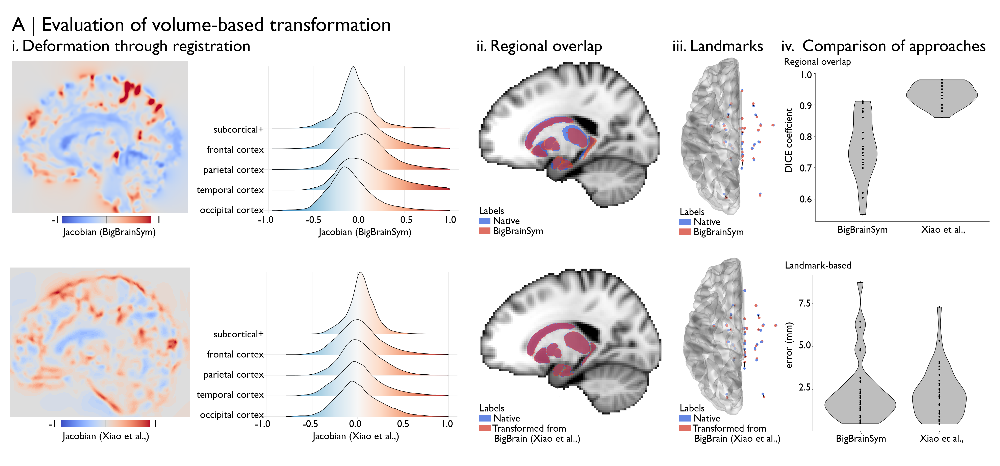

Tutorial 4: Evaluate transformations
============================================================================================================

Integration of BigBrain with MRI depends upon the accuracy of spatial transformations between the histological atlas and standard neuroimaging templates. In this tutorial, we’ll cover methods to evaluate accuracy of these transformations. This can provide insight regional variations in the accuracy and can be used to compare the performance of different transformations.

Volume-based
**************************************************************

Volume-based transformations represent the solution of an image registration problem. Image registration problems are often cast as minimisation problems, which minimise the difference between two images using divergence-based or information-theoretic measures (e.g. squared intensity difference, cross correlation, normalised mutual information) and contain a regularisation constraint on the degree of deformation (Leow et al., 2007). At the time of writing, two volume-based transformations have been specially developed for the registration of BigBrain to standard neuroimaging templates.
*1) `BigBrainSym <https://bigbrainwarp.readthedocs.io/en/latest/pages/FAQs.html>`_ * 
 “This co-registration was achieved by deforming BigBrain with an inverted intensity profile to a population-averaged T1 map that is co-registered to the MNI space, with the SyN algorithm”. 
*2) Xiao et al.,* aimed to improve upon the accuracy of BigBrainSym using a two-stage multi-contrast registration procedure. The first stage involved nonlinear registration of BigBrainSym to a PD25 T1-T2* fusion atlas (Xiao et al., 2017, 2015), using manual segmentations of the basal ganglia, red nucleus, thalamus, amygdala, and hippocampus as additional shape priors. Notably, the PD25 T1-T2* fusion contrast is more similar to the BigBrainSym intensity contrast than a T1-weighted image, such as the commonly used ICBM2009sym template. The second stage involved nonlinear registration of PD25 to ICBM2009sym and ICBM2009asym using multiple contrasts.

BigBrainWarp has an *evaluate_warp* function that, as the name suggests, allows you to evaluate a warp. Here, we’ll demonstrate its utility for the abovementioned transformations. It may also be used for a novel transformation of your own making, however.
… code block

	% for example, we’ll evaluate the Xiao et al., 
cd $bbwDir
sh scripts/evaluate_warp.sh --in_space bigbrainsym --out_space icbm –warp $bbwDir/xfms/BigBrain-to-ICBM2009sym-nonlin.xfm --wd /project/

*evaluate_warp* produces the three outputs:
#. warp_jacobian.mnc: The Jacobian map is the determinant of the Jacobian matrix of a deformation field. This provides a succinct measure distortions at each voxel that are invoked by the transformation procedure. Negative values indicate a contraction and positive values and expansion. The values encode the % change, i.e. 0.1 represents a 10% expansion.
#. reg_dice.txt: Dice coefficient of the overlap between native, manually segmented labels and the transformed labels. See https://osf.io/7w2dy/ for list of labels. 
#. af_dist.txt: Landmark registration errors (mm), based on anatomical fiducials (Liao et al.,) that were manually identified in BigBrainSym and ICBM152.

