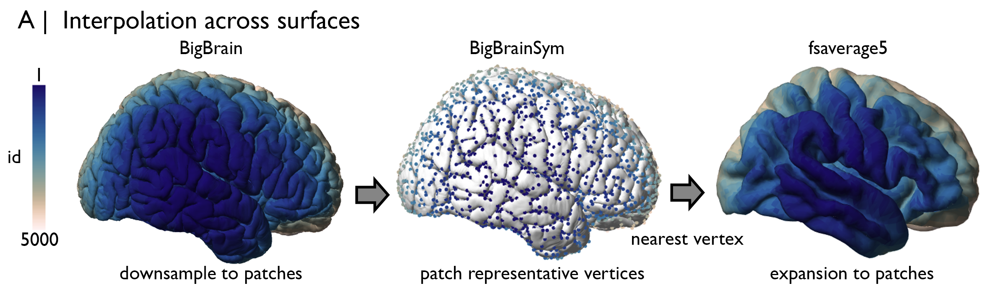
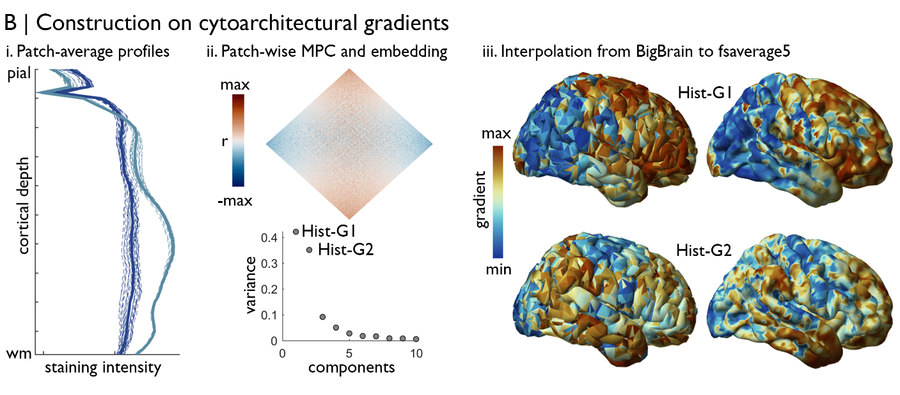
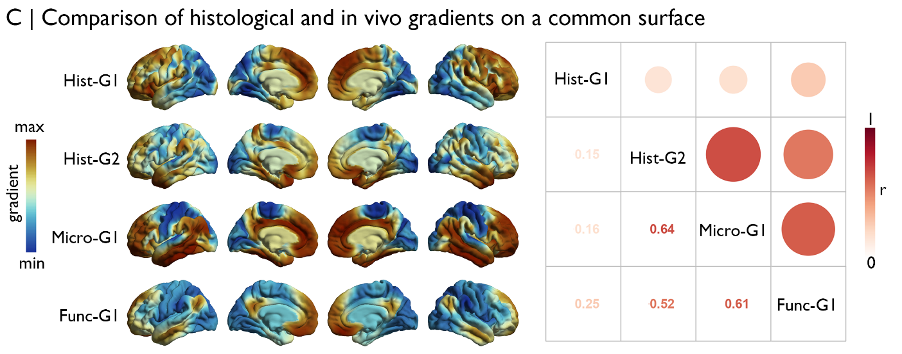

Tutorial 1: Comparing BigBrain- and MRI-derived gradients on a common surface
============================================================================================================

In this tutorial, we aim to inspect the convergence of large-scale `gradients <https://bigbrainwarp.readthedocs.io/en/latest/pages/glossary.html>`_ of cytoarchitecture, microstructure and functional connectivity. 

First, we need to identify the input data and the transformations necessary to examine BigBrain- and MRI-derived gradients on a common surface. For BigBrain, we can use `microstructure profiles <https://bigbrainwarp.readthedocs.io/en/latest/pages/glossary.html>`_ to resolve the cytoarchitectural gradients. This procedure will involve matrix manipulation that is infeasible with a `327684 <https://bigbrainwarp.readthedocs.io/en/latest/pages/bigbrain_background.html>`_ x 327684 array, however, so we will need to reduce the number of microstructure profiles prior to computation of the cytoarchitectural gradients. For MRI, we can use microstructure profiles of quantitative T1 mapping and resting state fMRI timeseries from the MICs dataset. Individual subject data must be aligned to a standard surface, for example `fsaverage5 (20484 vertices) <https://bigbrainwarp.readthedocs.io/en/latest/pages/glossary.html>`_, then again downsampled to a feasible number of parcels for cross-correlation and embedding. Finally, we will need to define an interpolation strategy from the downsampled BigBrain surface to the downsampled fsaverage5 surface.

The interpolation is the crucial linking step, so we’ll address this first and use it inform our approach for the gradient construction. Given the need to downsample BigBrain, we’ll start by performing mesh decimation on the BigBrainSym surface. We’ll use BigBrainSym throughout the surface interpolation because it already closely conforms to fsaverage5 in terms of shape and the coordinate system. Mesh decimation will decrease the number of vertices in the surface close to a prescribed number (in this case ~10,000) and retriangulate the surface, in such a way that preserves the overall shape. You can find the decimated mesh in **BigBrainWarp/scripts/nn_surface_indexing.mat** as the BB10 variable. 

.. code-block:: matlab

	% mesh decimation of BigBrainSym surface
	addpath(genpath(bbwDir))
	BB = SurfStatAvSurf({[bbwDir '/spaces/bigbrainsym/gray_left_327680_2009b_sym.obj'], ...
	[bbwDir '/spaces/bigbrainsym/gray_right_327680_2009b_sym.obj']});
	numFaces= 20484; 
	patchNormal = patch('Faces', BB.tri, 'Vertices', BB.coord.','Visible','off');
	Sds = reducepatch(patchNormal,numFaces);
	[~, bb_downsample]  = intersect(patchNormal.Vertices,Sds.vertices,'rows');
	BB10.tri = double(Sds.faces);
	BB10.coord   = Sds.vertices';

Rather than doing away with the other ~310,000 vertices though, we assign each of the removed vertices to the nearest maintained vertex, determined by shortest path on the mesh (ties are solved by shortest Euclidean distance). In this manner, all 320,000 vertices belong to one of ~10,000 patches. 

.. code-block:: matlab

	% For each vertex on BB, find nearest neighbour on BB10, via mesh neighbours
	nn_bb = zeros(1,length(BB.coord));
	edg = SurfStatEdg(BB);
	parfor ii = 1:length(BB.coord)
		nei = unique(edg(sum(edg==ii,2)==1,:));
		if isempty(nei) && ismember(ii,bb_downsample)
			nn_bb(ii) = ii;
		else
			while sum(ismember(nei, bb_downsample))==0
			nei = [unique(edg(sum(ismember(edg,nei),2)==1,:)); nei];
		end
		matched_vert = nei(ismember(nei, bb_downsample));
		if length(matched_vert)>1  % choose the mesh neighbour that is closest in Euclidean space
			n1 = length(matched_vert);
			d = sqrt(sum((repmat(BB.coord(1:3,ii),1,n1) - BB.coord(:,matched_vert)).^2));
			[~, idx] = min(d);
			nn_bb(ii) = matched_vert(idx);
		else
			nn_bb(ii) = matched_vert;
		end
	end

Again the nn_bb can be found pre-generated in **BigBrainWarp/scripts/nn_surface_indexing.mat**. We also perform the same type of mesh decimation and patching on fsavearge5, downsampling from 20484 vertices to ~10,000 patches.

.. code-block:: matlab

	% load fsaverage5 pial surface
	P = SurfStatAvSurf({[fsAv '/lh.pial'], [fsAv '/rh.pial']});
	% downsample surface
	numFaces= 20484;
	patchNormal = patch('Faces', P.tri, 'Vertices', P.coord.','Visible','off');
	Sds = reducepatch(patchNormal,numFaces);
	[~,downsampIdx]  = intersect(patchNormal.Vertices,Sds.vertices,'rows');
	P10.tri = double(Sds.faces);
	P10.coord   = Sds.vertices';

	% For each vertex on P, find nearest neighbour on P10, via mesh neighbours
	nn_fs = zeros(1,length(P.coord));
	edg = SurfStatEdg(P);
	parfor ii = 1:length(P.coord)
		nei = unique(edg(sum(edg==ii,2)==1,:));
		if isempty(nei) && ismember(ii,downsampIdx)
			nn_fs(ii) = ii;
		else
		while sum(ismember(nei, downsampIdx))==0
			nei = [unique(edg(sum(ismember(edg,nei),2)==1,:)); nei];
		end
		matched_vert = nei(ismember(nei, downsampIdx));
		if length(matched_vert)>1  % choose the mesh neighbour that is closest in Euclidean space
			n1 = length(matched_vert);
			d = sqrt(sum((repmat(P.coord(1:3,ii),1,n1) - P.coord(:,matched_vert)).^2));
			[~, idx] = min(d);
			nn_fs(ii) = matched_vert(idx);
		else
			nn_fs(ii) = matched_vert;
		end
	end

In this analysis, we plan to move the BigBrain-derived gradients to fsaverage5 space. The reverse transformation is equally acceptable, and the choice generally depends on the research question. Our choice here was swayed by having more maps constructed on fsavearge5. In other cases, especially when more detailed aspects of BigBrain are investigated, it’s useful to move from fsavearge5 to BigBrainSym. The transformations between BigBrainSym and fsaverage5 currently involve nearest neighbour interpolation based on shortest Euclidean distance, conducted within each hemisphere separately. We’ve precomputed this indexing to support easy interpolation between the surfaces. Of note, there is not a unique mapping of vertices between surface using this technique (i.e. 19039 BigBrainSym vertices map to 20484 fsaverage5 vertices and 17540 fsaverage5 vertices map to 327684 BigBrainSym vertices), and analyses should take this into account. For example, we can overcome this issue by performing statistical analyses only on unique vertices or by using patches.

With the downsampling and interpolation organised, we can move onto the construction of gradients. For BigBrain, we average microstructure profiles within each patch, then calculate the similarity between each pair of patch-average microstructure profiles, producing a microstructure profile covariance (MPC) matrix that reflects patch-wise cytoarchitectural similarity. Next, we calculate the normalised angle similarity between each row of the MPC matrix, which depicts patch-wise similarities in the patterns of MPC across the cortex. Then, we subject the normalised angle matrix to diffusion map embedding. Diffusion map embedding produces eigenvectors, describing the principle axes of variance in the input matrix, and resolve cortical `gradients https://bigbrainwarp.readthedocs.io/en/latest/pages/glossary.html`_. Each eigenvector is accompanied by an eigenvalue that approximates the variance explained by that eigenvector. Here, the first two eigenvectors explain approximately 42% and 35% of variance, respectively. Projected on to the downsampled BigBrainSym surface, the first two eigenvectors illustrate an anterior-posterior and a `sensory-fugal <https://bigbrainwarp.readthedocs.io/en/latest/pages/glossary.html>`_ gradient. You may note that the eigenvector decomposition is different to our previous `publication <https://journals.plos.org/plosbiology/article?id=10.1371/journal.pbio.3000284>`_, where the sensory-fugal gradient explained more variance than the anterior-posterior gradient. In our previous work, we regressed the midsurface y-coordinate from the microstructure profiles because we observed a strong increase in intensity values with the y-coordinate (r = −0.68) that appeared related to the coronal slicing of BigBrain. In BigBrainWarp, we have opted for a more a conservative approach to data cleaning to avoid obscuring potential non-artefactual anterior-posterior variations in staining intensity.

.. code-block:: matlab

    % BigBrain profiles
    load([bbwDir '/data/BB_profiles.mat'], 'MPsurface')
    
    % load downsampling indexing
    load([bbwDir '/scripts/nn_surface_indexing.mat'], 'nn_bb');
    
    % create MPC and gradient, using functions from the micaopen github
    MPC = build_mpc(MPsurface,nn_bb);
    normangle = connectivity2normangle(MPC, 0);
    [eigenvectors, results] = mica_diffusionEmbedding(normangle, 'ncomponents', 10);
    eigenvalues = results.lambdas/sum(results.lambdas);

Next, we interpolate the BigBrain-derived gradients to fsaverage5, using the pre-computed nearest neighbour interpolation from the downsampled BigBrainSym surface to fsaverage5.

.. code-block:: matlab
	% load indexing
	load([bbwDir '/scripts/nn_surface_indexing.mat'], 'nn_bb10_fs', ‘bb_downsample);

	% note: build_mpc uses the unique function to sort the parcels, so we need to reverse this procedure to align with the vertex ordering of bb_downsample
	[ubb, ia] = unique(bb_downsample);
	for ii = 1:length(ubb)
        	eigenvectors _sort(ia(ii),1:2) = eigenvectors(ii,1:2);
	end

	% use indexing to move to fsaverage
	HistG1 = eigenvectors (nn_bb10_fs,1);
	HistG2 = eigenvectors (nn_bb10_fs,1);

	

Et voila! The BigBrain-derived gradients are aligned to the MRI-derived gradients and can be statistically evaluated. The construction of the MRI-derived gradients is discussed at length in the `micapipe <https://micapipe.readthedocs.io/en/latest/>`_ documentation. Suffice to say, qT1 and rs-fMRI data from 50 healthy adults were registered to fsaverage5, then parcellated using the ~10k mesh patches discussed above. The microstructural gradient was generated using the MPC approach, with quantitative T1 images rather than BigBrain, and the functional gradient was created from resting state functional connectivity (a la `Margulies et al., <https://doi.org/10.1073/pnas.1608282113>`_).

For example, we may assess spatial correspondence of the gradients using Spearman correlations. We find that there is strong correlation between the sensory-fugal BigBrain-derived gradient with the MRI-derived microstructural gradient (r=0.64), and both of these are moderately correlated with the functional gradient (both r>0.5). In contrast, the anterior-posterior BigBrain-derived gradient does not overlap with the MRI-derived gradients (all r<0.3).

