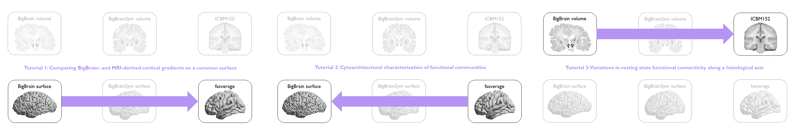

Overview of Tutorials
============================================================================================================

The tutorials cover three BigBrain-MRI analyses, which represent three unique types of transformations.

Neither the forms nor the motivations are exhaustive but are illustrate applications based on our previous work. If you feel adventurous, the range of transformations availed by BigBrainWarp look more like this:

.. image:: ./images/bbw_workflow_possibilities.png
   :height: 250px
   :align: center

The tutorials take a winding path through different programming languages. While BigBrainWarp is an open-source, bash and python-based toolbox, the tutorials utilise matlab for certain analyses and visualisation. As such, the `code for the tutorials <https://github.com/caseypaquola/BigBrainWarp/tree/master/tutorials>`_ is divided into steps based on the programming language. 

 

