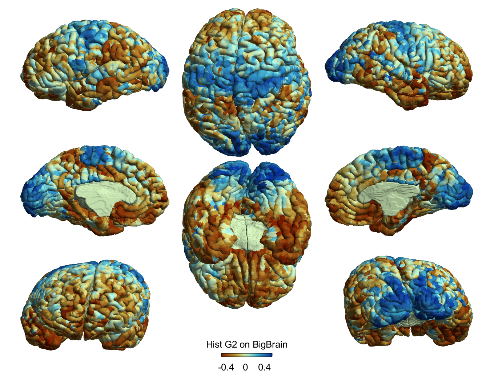
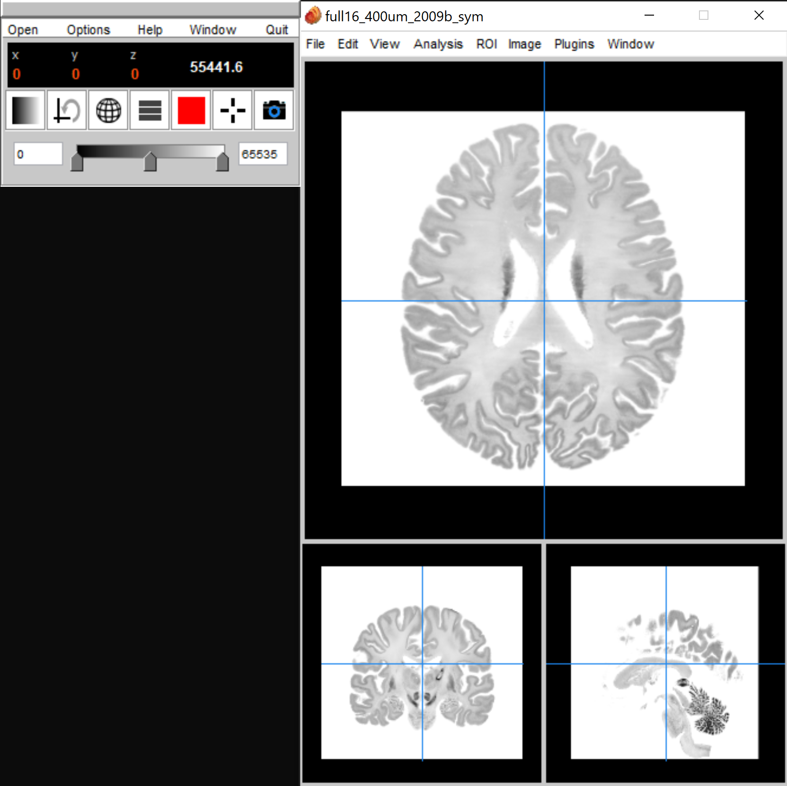

Visualisation across file formats
============================================================================================================

We should always visually check the fidelty of our data transformations. BigBrainWarp accepts and produces a range of file format, which require different types of visualisation. Here are a couple of tips for data visualisation, including a non-exhaustive list of visualisation tools for each file format. 

.. list-table::
   :widths: 20 80 50
   :header-rows: 1

   * - File format
     - Type
     - Visualisation tools
   * - Nifti (.nii)
     - Volume	
     - freeview, wb_view, MANGO, SurfStat
   * - MINC (.mnc)
     - Volume	
     - Display, MANGO, SurfStat
   * - Gifti (.gii)	
     - 3D geometry of surface (.surf.gii), vertex-wise data (.shape.gii) or vertex-wise labels (.label.gii)
     - wb_view, MANGO, Matlab
   * - Wavefront obj (.obj)
     - 3D geometry of surface
     - SurfStat, Display
   * - Freesurfer surface (.pial, .inflated, .white)
     - 3D geometry of surface
     - SurfStat, freeview
   * - Curv (.curv)
     - Vertex-wise data
     - freeview, SurfStat
   * - Annotation (.annot)
     - Vertex-wise labels and colour look up table
     - freeview, SurfStat

Surfaces: Matlab-based, SurfStat-powered
**************************************************************

Our favourite tool for surface-based analyses is `SurfStat <https://www.math.mcgill.ca/keith/surfstat/>`_. SurfStat is a Matlab toolbox for statistical analysis and visualisation of neuroimaging data. You can download the toolbox as well as tutorials and extra helper functions from the `micaopen github <https://github.com/MICA-MNI/micaopen/tree/master/surfstat>`_. By combining this with in-built Matlab functions, Freesurfer's Matlab add-ons and the `gifti toolbox <https://www.artefact.tk/software/matlab/gifti/>`_, we can load and inspect MINC (.obj, .mnc), Freesurfer and Gifti datatypes in one easy space. 

.. code-block:: matlab

	% set directories
	GH 		= '/path/to/your/github/directories/
	bbwDir 		= [GH '/BigBrainWarp/'];

	% add directories to path
	addpath(genpath([GH '/micaopen/surfstat']));	
	addpath([bbwDir '/scripts/']);
	addpath(genpath('/path/to/gifti-1.6/'));  % download from https://www.artefact.tk/software/matlab/gifti/

	% 1. Load the surface
	% .obj
	BB = SurfStatAvSurf({[bbwDir '/tpl-bigbrain/tpl-bigbrain_hemi-L_desc-pial.obj'], ...
			[bbwDir '/tpl-bigbrain/tpl-bigbrain_hemi-R_desc-pial.obj']});
	% Binary Freesurfer surfaces (ie: .pial, .white, .sphere etc)
	FS = SurfStatAvSurf({[bbwDir '/tpl-fsaverage/tpl-fsaverage_hemi-L_desc.pial'], ...
			[bbwDir '/tpl-fsaverage/tpl-fsaverage_hemi-R_desc.pial']});
	% Gifti surfaces
	tmp_lh = gifti([bbwDir '/spaces/tpl-fs_LR/tpl-fs_LR_hemi-L_den-32k_desc-inflated.surf.gii']);
	tmp_rh = gifti([bbwDir '/spaces/tpl-fs_LR/tpl-fs_LR_hemi-R_den-32k_desc-inflated.surf.gii']);
	FSLR32.coord = [tmp_lh.vertices' tmp_rh.vertices'];			% coord and tri are the two expected components of a SurfStat surface structure
	FSLR32.tri = [tmp_lh.faces; tmp_rh.faces+length(tmp_lh.vertices)];
	
	% 2. Load the data
	% .txt data
	tmp_lh = readmatrix([bbwDir '/spaces/tpl-bigbrain/tpl-bigbrain_hemi-L_desc-Hist_G1.txt']);
	tmp_rh = readmatrix([bbwDir '/spaces/tpl-bigbrain/tpl-bigbrain_hemi-R_desc-Hist_G1.txt']);
	BB_G1 = [tmp_lh; tmp_rh];
	% Freesurfer-style curv data
	tmp_lh = read_curv([bbwDir '/spaces/tpl-fsaverage/tpl-fsaverage_hemi-L_den-164k_desc-Micro_G1.curv']);
	tmp_rh = read_curv([bbwDir '/spaces/tpl-fsaverage/tpl-fsaverage_hemi-R_den-164k_desc-Micro_G1.curv']);
	FS_G1 = [tmp_lh; tmp_rh];
	% gifti data
	tmp_lh = gifti([bbwDir '/spaces/tpl-fs_LR/tpl-fs_LR_hemi-L_den-32k_desc-Hist_G1.shape.gii']);
	tmp_rh = gifti([bbwDir '/spaces/tpl-fs_LR/tpl-fs_LR_hemi-R_den-32k_desc-Hist_G1.shape.gii']);
	FSLR32_G1 = [tmp_lh.cdata; tmp_rh.cdata];

	% 3. Visualise data
	figure; SurfStatViewData(BB, BB_G1)
	figure; SurfStatViewData(FSLR32, FSLR32_G1)

	
Displaying MINC
*******************************

The volume-based transformations in BigBrainWarp depend upon `MINC <https://bic-mni.github.io/#MINC-Tool-Kit>`_. BigBrainWarp enables conversions to nifti, so it may not be necessary to check the intermediary .mnc files yourself, but if you would like to then we'll turn your attention towards `Display <https://www.bic.mni.mcgill.ca/software/Display/Display.html>`_. With Display, you can also overlay .obj surfaces on the volume.

.. code-block:: bash

	Display volume_file.mnc
	
	# Click "File" then "Load File"
	# in the terminal
	/full/path/to/surface_file.obj
	
	# Return to Main Menu, Click "Objects" then "Write Object to File"

	

.. image:: ./images/display_screenshot1.PNG
   :height: 300px
   :align: center
	
  

.. image:: ./images/display_screenshot2.PNG
   :height: 300px
   :align: centre

MANGO 🥭
*******************************

Freeview
*******************************

Freeview is the built-in visualisation tool of Freesurfer and is handy for all Freesurfer-style file formats.

 

