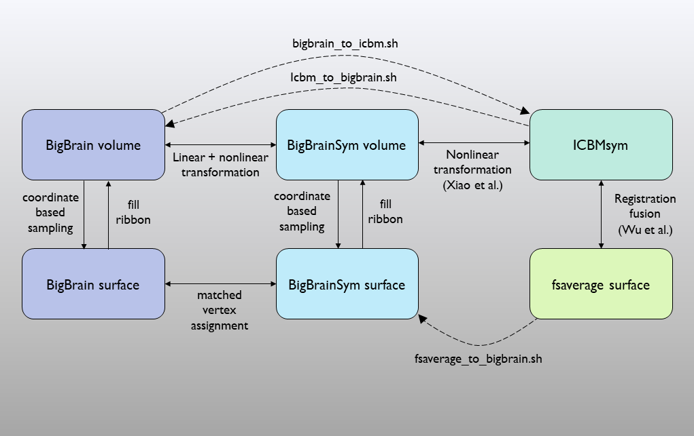
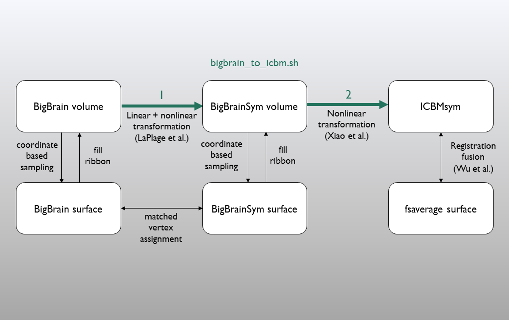
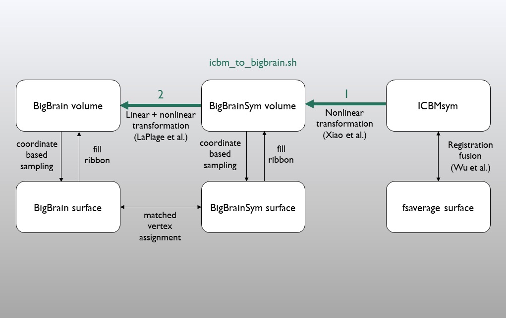
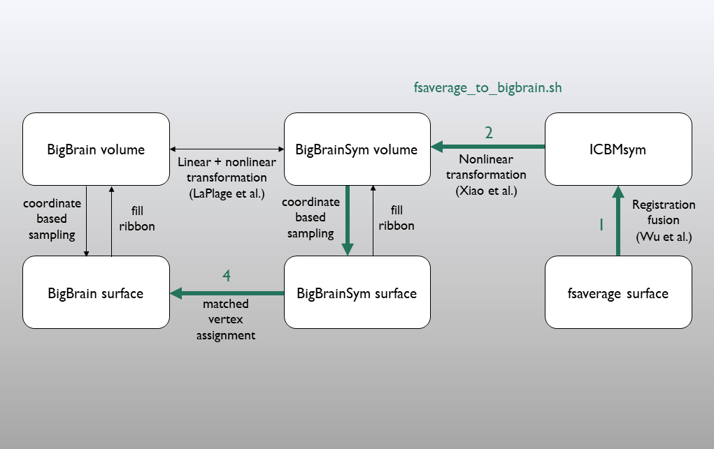

Workflow
==================

Multi-modal integration of BigBrain involves many moving parts. Here's a simple schema of the core transformations that are involved.

Upacking this further, the most simple scripts that transform between BigBrain and ICBM volumetric would follow the paths:

In contrast, the conversion from fsaverage to the BigBrain surface, for example with an MRI-derived cortical gradient, follows the path:

